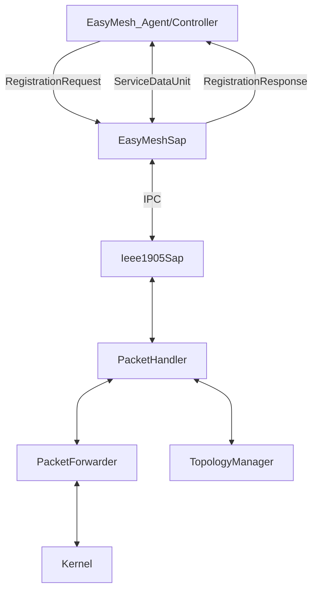
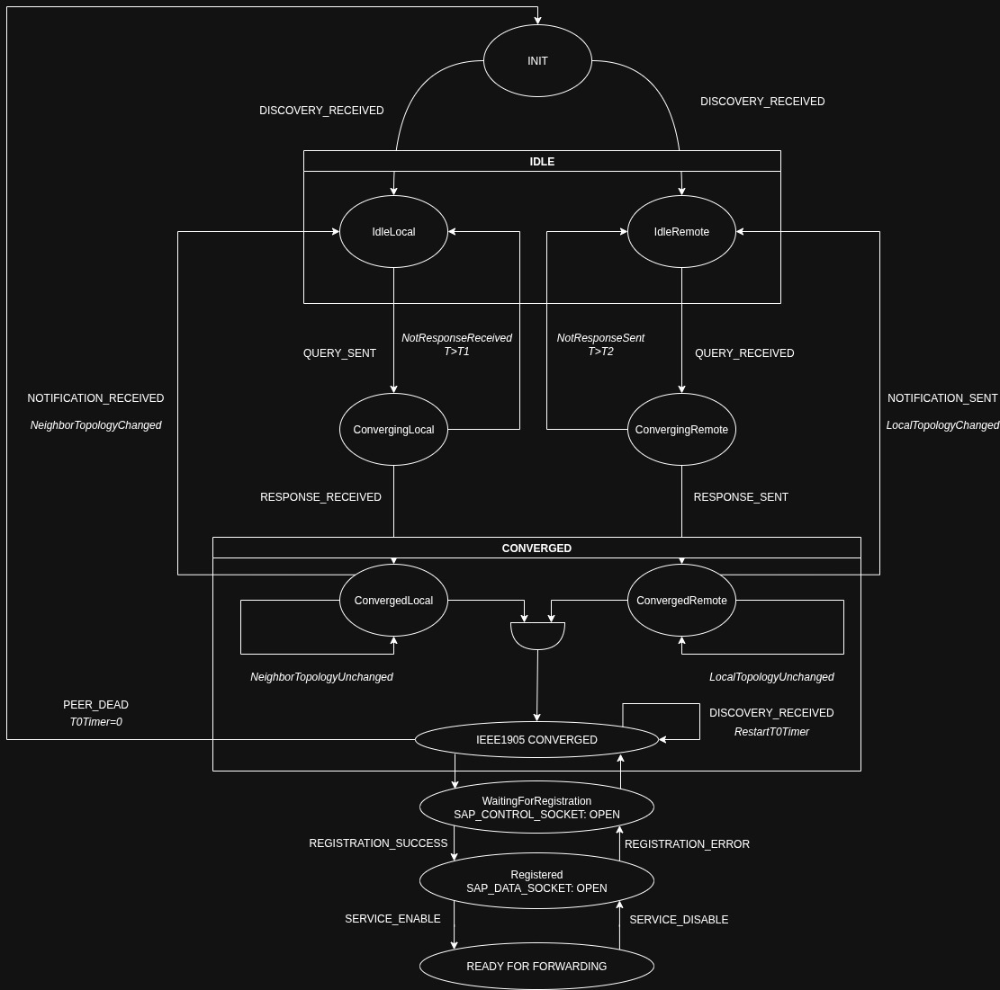
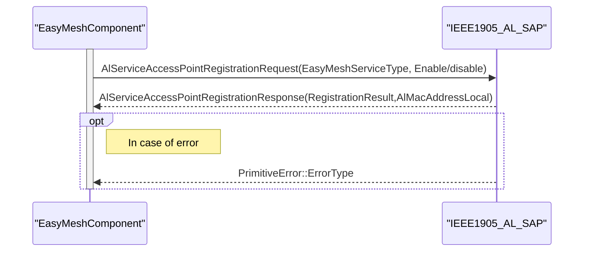
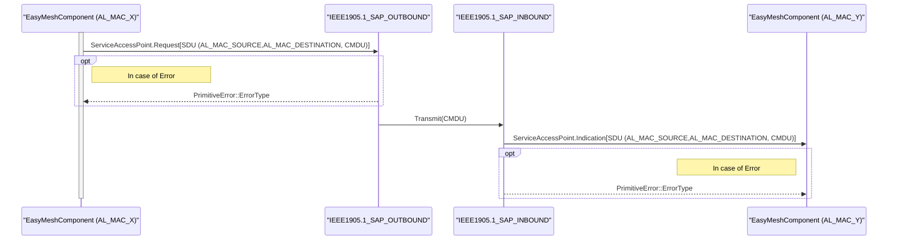
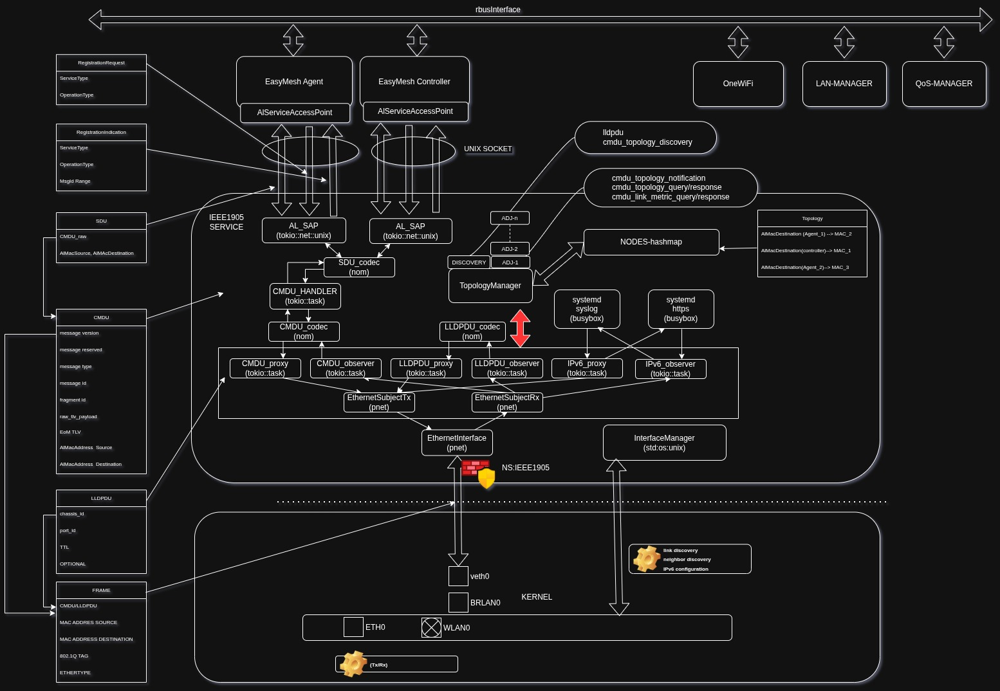
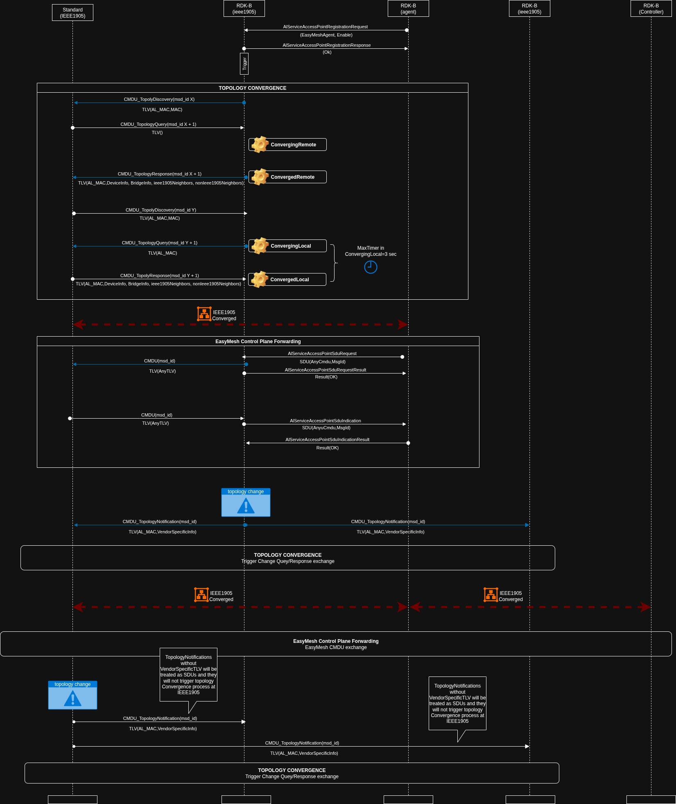
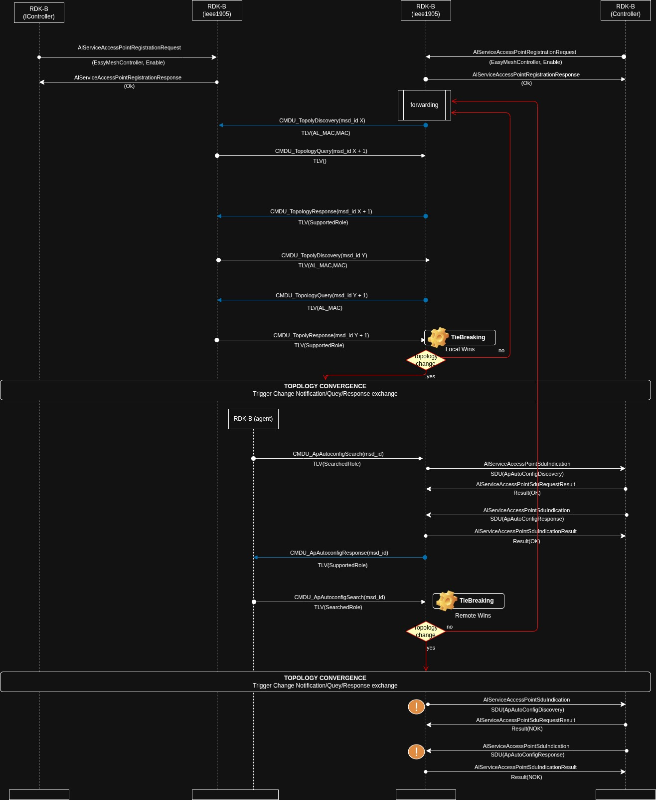
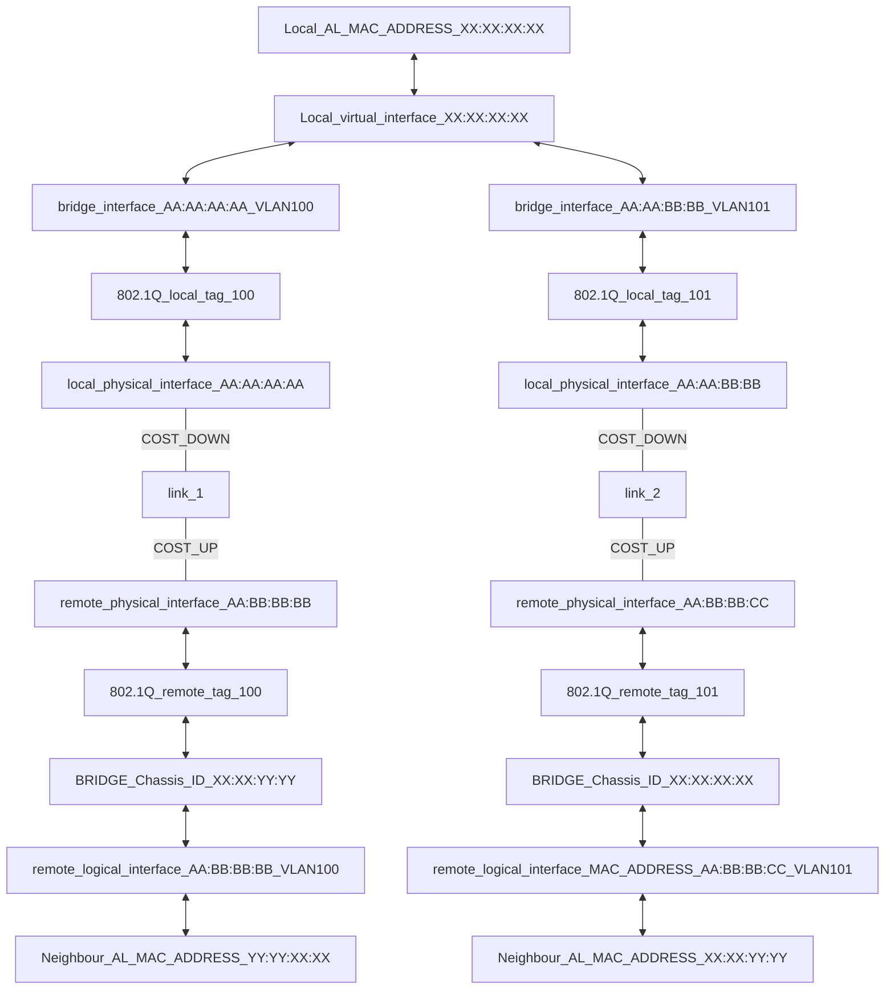

# IEEE1905.1 RDK-B component

## IEEE1905.1 Overview

IEEE 1905.1 is a standard developed by the Institute of Electrical and Electronics Engineers (IEEE) for providing a uniform method for devices to communicate and interoperate within a home network environment. It defines a protocol that enables devices from different manufacturers to seamlessly communicate and share resources, regardless of their underlying technologies.

One of the key components of IEEE 1905 is the Application Layer SAP, which is responsible for managing communication between the higher-level entities (HLEs) and the lower layers of the network stack, and more specifically the IEEE 1905 adaptation layer.
In order to identify multiple SAPs between AL and HLE layers, we identify the SAP as the AL_MAC_ADDRESS of the remote entity.

## IEEE1905 Adaptation Layer MAC Service Access Point

IEEE1905 Adaptation Layer MAC Service Access Point will provide IEEE1905 transport service to applications in the RDK-B stack through a set of service primitives. These primitives have been creted with two goals in mind, registration of consumers that will make use of the IEEE1905 stack, using service-registration-request and service-registration-response APIs and exchange of service data units via service-data-request and service-data-indication, through the AL MAC service access point, refered as SAP in the rest of the document.  

### IEEE1905 Service functional requirements

| Functional Requirement     | Description     |
|--------------|--------------|
| **Activation process** | SAP will provide the API's necessary to activate the transport service from the EasyMesh Agent   and Controller through the AL_SAP |
| **Registration request** | SAP will provide the API necessary to activate and deactivate the transport service through the SAP and to identify the role ot the applicatoin that requests access to IEEE1905 layer|
| **Registration response** | SAP will provide the API necessary to provide the response to a registration request to the IEEE1905 service including the result of the registration request and any information necessary to make use of the transport service|
| **Payload transport**  | EasyMesh agent, EasyMesh Controller and any other High Level Entity will use binary payload through SAP as transport using SDUs defined as part ot the AL_SAP definition and AL_SAP API (primitives) for data transmission and reception|
| **Content Agnostic**  | AL_SAP will be agnostic in regards of the content of the SDU's, they will treated as as binary payload through the AL_SAP and at the IEEE1905 layer they will be treated as CMDU's (framing functionality) or as a vector of TLV's (parsing functionality)|
| **CMDU responsability** | IEEE1905 SAP will provide payload transport service of EasyMesh CMDU's in addition to the CMDU's used internally by the IEEE1905 to maintain the topology map |
| **CMDU validation**  | IEEE1905 will be responsible for the completeness of CMDU's sent and received|
| **SDU/CMDU fragmentation** | IEEE1905 SAP will provide fragmentation and reassembly service for SDU's and CMDU's|
| **CMDU encryption**  | IEEE1905 will provide encryption service and message integrity validation for CMDU's|
| **Path Performance monitoring**  | IEEE1905 SAP will provide an active measurements service to monitor path health and performance monitoring|

### IEEE1905 Software Stack

In current implementations of EasyMesh, the IEEE1905 stack is deeply integrated into both the EasyMesh agents and controller. This tight coupling between the two standards means that the functionalities of IEEE1905, which handles the transport of network information, and EasyMesh, which manages mesh network control, are often intertwined within the same system components.  

However, in our implementation, we found it necessary to clearly separate the EasyMesh functionalities from the IEEE1905 stack. This separation allows for more modular design and flexibility, enabling independent development, testing, and maintenance of each protocol. By decoupling EasyMesh from IEEE1905, we ensure that each layer can evolve independently while maintaining interoperability, which is particularly important in complex mesh networking environments. This also allows for clearer distinction between mesh network management (EasyMesh) and control transport services and topology management (IEEE1905), improving the overall system architecture.
The IEEE1905 SAP will be used as C++ library compiled as part of application binaries that will be required to use IEEE1905 transport service, and the implementation will follow OOP principles of reusability and modularity.  



### AL MAC SAP API's

The IEEE1905_AL_SAP will provide the following API abstraction to use the service:

1. Registration APIs: it will be used to register the application (EMagent or EMcontroller for instance) to access the SAP, initializing parameters that the application could require from the IEEE1905 service.  
    1. **AlServiceRegistrationRequest()**: This primitive is used to establish the connection to the IEEE1905 service. The application will register to use one of the services currently supported by the IEEE1905 service:
        1. EasyMeshClient: it will use standard IEEE1905 framing, assuming the application is the Controller/Registree.
        2. EasyMeshController: it will use standard IEEE1905 framing, assuming the application is the Controller/Registrar.

    2. **AlServiceRegistrationResponse()**:  This primitive is used by the IEEE1905 service to inform about the result of the registration and to provide the local AlMacAddress in case the application cannot select one and the MSGidRange to be used in the CMDU's generated by the application on top of IEEE1905 service.

    3. **AlServiceTopologyNotification()**:  This primitive is used by the IEEE1905 service to keep the cache of the al_mac addresses availabe in the topology map so if the HLE tries to send an SDU to a node which al_mac is not in the cache, IEEE1905 service will generate a primitive error, in a shape of a C++ exception according to C++ standard library.

2. Control plane transport service APIs

    1. **AlServiceDataRequest()**: This API is used  to request the transmission of a SDU (service data unit) to the IEEE1905 service through the SAP, and the SDU will contain, the IEEE1905 CMDU and the AlMacAddress of the source and destination.
    In case of SDU processing errors during SAP transfer for transmission, IEEE1905 service will generate a primitive error, in a shape of a C++ exception according to C++ standard library.
    2. **AlServiceDataIndication()**: This API is used by applications to listen and receive a SDUs (service data unit) from the IEEE1905 service through the SAP, as before for the request,the SDU will contain the IEEE1905 CMDU created by the remote application, plus AlMacAddress source and destination.
   In case of SDU processing errors during SAP transfer for reception, IEEE1905 service will generate a primitive error, in a shape of a C++ exception according to C++ standard library.

## AL Finite State Machine

### Finite State machine Diagram



## AL Primitives Call Flow

### Registration service



---

### Transport service



---

## Component diagram



---

### Network Topology service IEEE1905

Network topology refers to the arrangement of various elements (IEEE1905 nodes) in a home network and it defines how nodes are connected and how data flows between them.
IEEE1905 has been specified to work in multiple topologies but it is specially used in daisy chain topologies as the one in EasyMesh, where typically each device is connected to two other devices, forming a linear sequence, much like the links in a chain.

---

1. **Graph Structure**
    Based on the capability of devices to process IEEE1905 CMDU packets we can distinguish two different kind of nodes:
    1. **IEEE1905 devices: This kind of devices understand CMDU packets and keep a copy of the topology map that they can exchange with other IEEE1905 devices**
        1. Endpoint nodes: The first and last devices in the chain have only one connection each, to their immediate neighbor and they don't require to have bridging capabilities.
        2. Intermediate nodes: Devices with more than one link connected to a IEEE1905 device with bridging capabilities, to relay CMDU packets through interfaces.
    2. **NON-IEEE1905 devices: This kind of devices don't understand and process IEEE1905 packets**

    In addition to the previous roles in IEEE1905 will build the topology map, adding information related to NON IEEE1905 devices, these devices will not participate in the exchange of CMDU packets, but based on their bridging capabilities they will be able to rely CMDU packets through their bridges.

2. **Topology construction**

    The topology construction process in IEEE1905 consists of the following steps:

    1. LLDP discovery:

        Before CMDU packet exchange, IEEE1905 will trigger LLDP protocol to discover neighbors with bridging capabilities, and include it as part of the topology graph. LLDPDU's use a link local multicast address being consumed by the linux bridge so in RDK-B use case will not reach the IEEE1905 service.

    2. Topology Discovery Advertisement:

        Each IEEE1905 device periodically broadcasts 1905 Topology Discovery Messages on all its available network interfaces (Wi-Fi, Ethernet, MoCA, PLC).
        These messages include the AL_MAC address as well as the device's Media Access Control (MAC) address and details about the specific interface over which the message is sent.

    3. Neighbor Discovery:

        Devices that receive the topology discovery messages recognize the sender as a neighboring IEEE1905 device.
        The receiving device stores this information, including the AL_MAC address of the sender and the MAC address of the interface on which the message was sent, in its local topology map.

    4. Topology Query and Report:

        To get a more detailed view of the network, a device will send a Topology Query Message to any of its neighboring devices.
        The queried device responds with a Topology Response Message, which contains more comprehensive information about the network topology, including all the devices it knows and their interconnections.

    5. Topology Map Update:

        As devices exchange topology information, each IEEE1905 device updates its local topology map.
        This map contains information about all known devices in the network, the technologies they are using, the interfaces through which they are connected, and the quality of the paths used to reach them.
        As result of updates in the topology map, IEEE1905 devices will broadcast Topology Notification to all their neighbors, and their neighbors will retrieve the information using Topology Query/Report messages from teh originator of the modification.

    6. Periodic Refresh:

        The topology discovery process is continuous, with devices periodically re-broadcasting their presence and updating their topology databases as they receive new information.
        This ensures that the topology information remains current, even as devices join, leave, or move within the network.

    7. Split Brain scenario protection.

        As part of the topology graph construction process, the IEEE1905 agent shall inspect the AP Autoconfig Search CMDU and AP Autoconfig Response CMDU delivered to the EM-HLE in order to identify and record the AL_MAC address of the registrar in the topology graph.

        The IEEE1905 entity shall not participate in the registrar selection process. However, the topology graph shall contain no more than one registrar per network.
        Registrar management shall follow the procedure below:

        1. When the AL_SAP receives a registration request from the HLE to assume the controller role, the IEEE1905 entity shall verify whether a registrar is already present in the network.

        2. If no registrar is detected, the HLE shall assume the registrar role. In this case, AL_SAP shall:

            2.1 Accept incoming ServiceRequest SDUs containing AP_Autoconfig_Search messages.

            2.2 Transmit outgoing SDUs containing AP_Autoconfig_Response messages.

        3. If a registrar is detected, the AL_SAP shall perform the tie-breaking procedure:
            3.1 If the local entity wins, AL_SAP shall accept incoming ServiceRequest SDUs containing AP_Autoconfig_Search messages and transmit outgoing CMDUs containing AP_Autoconfig_Response messages.

            3.2 If the remote entity wins, AL_SAP shall filter all AP_Autoconfig SDUs.

        4. If the current registrar becomes unavailable, as determined through topology-notification-triggered convergence, a new registrar shall be selected as part of the network convergence process, following steps 1 through 3.

        5. If a new registrar is detected through topology-discovery-triggered convergence, registrar selection shall again be performed as part of the network convergence process, following steps 1 through 3.

    8. Path Performance monitoring.

        Since current IEEE1905 link-metric CMDUs relies strongly on WiFi parameters to calculate the performance of links, as part of the current project but separated from the IEEE1905 standard implementation we will create a simple performance monitoring protocol inspired on the etherate project, to measure quality parameters on the current forwarding path and store it in the topology map, this information will be exposed to the HLE's to make their decision in forwarding path selection:

        | **Metric**       | **How it’s Measured**                                |
        |------------------|------------------------------------------------------|
        | Reachability     | Send poll-stat messages and echo them                |
        | RTT              | Send timestamp – reply receipt                       |
        | Jitter           | Variance in measured RTTs                            |
        | Loss             | Gaps in sequence numbers                             |
        | Throughput       | Bytes sent/received per unit of time                 |
        | Out-of-order     | Detected via non-monotonic sequence numbers          |

    9. 1905 Layer Security Capability.

        According to EasyMesh specification chapters 13.1, 17.2.67, 17.2.68, 17.2.69, we will provide encryption and message integrity service for the TLV's.

---

### Topology build Call Flow

---



---

### Protection against split brain scenario

---



---

### IEEE1905.1 Forwarding Table

The forwarding table will be used to select the MAC address for source and destination used in the ethernet frames, based on the AL MAC source address and destination, to transport CMDU packets.

Below an example for 2 devices directly connected to our local device.



### IEEE1905.1 Topology Map

The topology map provides all the information collected through Topology CMDUs exchange

<!-- markdownlint-disable MD010 -->

```text
|─TOPOLOGY_MAP:
└──AL_MAC_ADDRESS: AA:AA:AA:A0
    |
    └── INTERFACE_MAC_ADDRESS: (BB:AA:AA:A0)
        |── MEDIA_TYPE: (0x0001)
        |── BRIDGE_FLAG: TRUE
        |── BRIDGE_TUPLE: 0
        └── VLAN: 'UNTAG'
            |
            |── IEEE1905NeighborDeviceList
            |	|── IEEE1905NeighborDevice
            |	|       |── AL_MAC_ADDRESS: (AA:AA:AA:A1)
            |	|       |── INTERFACE_MAC_ADDRESS: (BB:AA:AA:A1)
            |	|	    |── STATE: TOPOLOGY_STATE
            |	|	    |── LAST_SEEN: 10
            |	|	    |── MESSAGE_ID_LAST_PACKET: 12
            |	|		|── LLDP-INFO
            |	|   	|── PATH_METRICS
            |	|	    |	|── RTT
            |	|	    |	|── JITTER
            |	|		|	|── THROUGHPUT
            |	|	    |	└── LOST PACKETS
            |	|	    └── LocalInterfaceList
            |	|	    	|── INTERFACE_MAC_ADDRESS: BB:AA:AA:A01
            |	|	    	|	|── MEDIA_TYPE: (0x0001)
            |	|	    	|	|── BRIDGE_FLAG: TRUE
            |	|	    	|	|── BRIDGE_TUPLE: 0
            |	|	    	|	└── NonIEEE1905NeighborList
            |	|	    	|		|── (AA:BB:CC:A0)]
            |	|	    	|		|── (AA:BB:CC:A1)]
            |	|			|		└── (AA:BB:CC:A2)]
            |	|	    	└──INTERFACE_MAC_ADDRESS: BB:AA:AE:A01
            |	|			    |── MEDIA_TYPE: (0x0001)
            |	|			    |── BRIDGE_FLAG: TRUE
            |	|			    |── BRIDGE_TUPLE: 0
            |	|			    └── NonIEEE1905NeighborList
            |	|			    	|── (AA:BF:CC:A0)]
            |	|			    	|── (AA:BF:CC:A1)]
            |	|			    	└── (AA:BF:CC:A2)]
            |	|
            |	└── IEEE1905NeighborDevice
            |	   
            └── NonIEEE1905NeighborList
                |── (AA:BB:CC:A0)]
                |── (AA:BB:CC:A1)]
                └── (AA:BB:CC:A2)]
```

## Installation

### Prerequisites

1. Ensure that you have `systemd` installed on your system.

2. Ensure you include in your system Rust and cargo version 1.83.0 (MSRV).

3. Ensure git is installed in your system.

4. Ensure jq is installed in your system.

5. Ensure you can run the script with sudo privileges.

6. Ensure the script is executable.

### Logging

Logs produced by the application will be stored into `/var/log/rdkb-ieee1905/` and the configuration will be included as part of systemd unit configuration.

Log rotation will be possible as part of the installation script by changing `/etc/logrotate.d/rdkb-ieee1905`:

 ```sh
    /var/log/rdkb-ieee1905/*.log {
    daily
    rotate 7
    compress
    missingok
    notifempty
    create 0640 rdkbuser rdkbgroup
    postrotate
        systemctl restart rdkb-ieee1905.service > /dev/null
    endscript
}
```

### Install the Application into your machine

All the logic for the installation and activation has been included into the build_and_install script:

```sh

    git clone https://github.com/rdkcentral/rdkb-ieee1905.git
    cd rdkb-ieee1905/utils
    ./build_and_install

```

### Managing the Service

You can use this simple systemd unit to launch the ieee1905 service in the
background:

```sh

cat /lib/systemd/system/ieee1905.service

```

```sh

[Unit]
Description=IEEE1905 topology service
After=network.target

[Service]
ExecStart=/usr/bin/ieee1905

[Install]
WantedBy=multi-user.target
```

Once installed into the systemd service path (`/lib/systemd/system`), you can
enable the service and manage it like so:

```sh
systemctl daemon-reload
systemctl enable ieee1905.service
systemctl start ieee1905
systemctl stop ieee1905
```

Output from the ieee1905 process can be viewed via journalctl:

```sh
journalctl -u ieee1905.service
2025 Mar 28 01:09:50 armefi64-rdk-broadband systemd[1]: Started IEEE1905 topology service.
2025 Mar 28 01:09:51 armefi64-rdk-broadband ieee1905[1242]: Tracing initialized!
```

### Service command line arguments

By default service run with topology CLI enabled, info log level, listening on ```eth0``` interface and unix sockets named ```/tmp/al_control_socket``` and ```/tmp/al_data_socket```.

#### Enable topolgy CLI

By default topology CLI is disabled.
When topology CLI is enabled. Log files are saved to a file and will not appear on standard output.

```/usr/bin/ieee1905 -t```

#### Change log level

To enable trace log:
``` /usr/bin/ieee1905 -f trace ```
Other log levels can also be used ```debug,warn,error,info```
Logging can be limited to certain modules for example to set trace level for topology manager and suppress all other logs:
```/usr/bin/ieee1905 -f ieee1905::topolgy_manager=trace```
If needed certain module can be filtered out completly:
```/usr/bin/ieee1905 -f ieee1905=trace,ieee1905::ethernet_subject_reception=off```
With above all ieee1905 modules will log with trace level and ethernet_subject_reception will not be visible in logs.

##### Available modules

```rust
ieee1905::al_sap
ieee1905::cmdu_codec
ieee1905::cmdu_handler
ieee1905::cmdu_message_id_generator
ieee1905::cmdu_observer
ieee1905::cmdu_proxy
ieee1905::cmdu_reassembler
ieee1905::device_edge_manager
ieee1905::ethernet_subject_reception
ieee1905::ethernet_subcjet_transmission
ieee1905::interface_manager
ieee1905::lib
ieee1905::lldpdu_codec
ieee1905::lldpdu_observer
ieee1905::lldpdu_proxy
ieee1905::main
ieee1905::registration_codec
ieee1905::sdu_codec
ieee1905::tlv_cmdu_codec
ieee1905::tlv_lldpdu_codec
ieee1905::topology_manager
```

#### Enable console subscriber

In order to analyze service with tokio-console use:

``` /usr/bin/ieee1905 -q -c -f trace,tokio=trace ```

This will disable topology CLI, enable console subscriber and set both regular and tokio logs to trace level.

#### Change unix socket

Change unix sockets to ```ctrl.sock``` and ```data.sock```

``` /usr/bin/ieee1905 --sap-control-path /tmp/ctrl.sock --sap-data-path /tmp/data.sock ```

#### Change listening interface

Change interface to ```eth1```

``` /usr/bin/ieee1905 -i eth1 ```

#### Enable file output

```/usr/bin/ieee1905 -i eth1 --file-appender```

### Build options

IEEE1905 service can be build with few compile time switches.
By default tokio-console is not included in binary.
In order to enable it one has to build with following command:

```cargo build --release --features "enable_tokio_console"```

Additionally default build supports size based fragmentation of TLVs.
To enable TLV based fragmentation default feature parameters has to be dropped:

``` cargo build --release --no-default-features ```

Then resulting binary will have tokio-console disabled and TLV based fragmentation enabled.

On other hand:

``` cargo build --release --all-features ```

Will enable all supported features.

#### Supported features

| Feature                  | Default       |
| ------------------------ |:-------------:|
| size_based_fragmentation | ENABLED       |
| enable_tokio_console     | DISABLED      |

### Yocto integration

For the best experience, use the [meta-lts-mixins](https://git.yoctoproject.org/meta-lts-mixins/) layer
to upgrade the version of Rust from that included in OpenEmbedded.

```sh
   git clone --branch=kirkstone/rust https://git.yoctoproject.org/meta-lts-mixins
   bitbake-layers add-layer meta-lts-mixins
```

You can use [`cargo-bitbake`](https://github.com/meta-rust/cargo-bitbake) to generate
a BitBake recipe for this package.

As BitBake/Yocto builds do not have network access during the build cycle,
it is a requirement that the entire dependency graph for the package is added
to `SRC_URI` (including optional packages that are not used at runtime).

`cargo-bitbake` can generate the `SRC_URI` additions for you.

On Yocto 5 (`scarthgap` and later), you will also need to supply
checksums for each package in the dependency graph.

You can use Yocto's [`cargo-update-recipe-crates`](https://docs.yoctoproject.org/dev/ref-manual/classes.html#cargo-update-recipe-crates)
to assist in updating the dependency graph.

Note: `Cargo.lock` **must** be up to date (run `cargo update`) with `Cargo.toml`,
and with the recipe `SRC_URI` list, or Bitbake will not proceed with
building the package.

```sh
# Ensure Rust and Cargo are available
inherit cargo

DESCRIPTION = "IEEE 1905 Rust Program"
LICENSE = "Apache-2.0"
LIC_FILES_CHKSUM = "file://LICENSE;md5=b538373fe584898492d2ad3a91014d58"

# Source repository
SRC_URI = "git://git@github.com/rdkcentral/rdkb-ieee1905.git;branch=main;protocol=ssh"
SRCREV = "589eccc05be0201592d169597c254375ef8d516c"

# Source directory
S = "${WORKDIR}/git"

# IMPORTANT!
# RUST_PANIC_STRATEGY="abort" must be in the
# machine or bitbake local.conf for this
# package to build successfully

# Builds under bitbake do not have network
# access, so all dependent rust crates
# must be added as SRC_URI
# You can use cargo-bitbake to create this list
SRC_URI += " \
    crate://crates.io/addr2line/0.24.2 \
    crate://crates.io/adler2/2.0.0 \
    ...
\"

```

#### Cross compilation to target Yocto (without bitbake)

There are two considerations when cross-compiling for a Yocto environment.

1. Architecture

   We are using the 64-bit Arm (arm64/aarch64) SystemReadyArm compliance program environment for verification.

   Most people use x86/Intel architecture devices for development.
   If you have a native Arm64 development environment, you will have a smoother experience, but the considerations below still apply.

2. System library versions

   Yocto releases generally use older C Library (GLIBC) versions than used in current desktop distributions.

   While rust has excellent cross compilation support, the Rust compiler will target the same GLIBC version as on the host.

The instructions below assume you are using [rustup](https://rustup.rs) to manage your Rust environments.

#### Method 1: Use MUSL target with rustup

By targetting the MUSL C library, we can avoid mismatches between GLIBC versions.

However, you still need an Arm64 C compiler for linking purposes.

On Ubuntu, you can use the pre-packaged Arm64 compiler:

```sh
apt install gcc-aarch64-linux-gnu
```

Then, add a MUSL target with rustup:

```sh
rustup target add aarch64-unknown-linux-gnu
```

You will need to tell cargo to use the arm64 compiler when targetting arm64.

This can be done by adding a target option in `$HOME/.cargo/config.toml`:

```sh
cat "$HOME/.cargo/config.toml"

[target.aarch64-unknown-linux-musl]
linker = "aarch64-linux-gnu-gcc"
```

Then, you can do a build for the `aarch64-unknown-linux-musl` target:

```sh
cargo build --target=aarch64-unknown-linux-musl
```

The resulting build will be in `target/aarch64-unknown-linux-musl`:

```sh
$ file target/aarch64-unknown-linux-musl/debug/ieee1905
target/aarch64-unknown-linux-musl/debug/ieee1905: ELF 64-bit LSB executable, ARM aarch64, version 1 (SYSV), statically linked
```

You can also compile a release build by adding `--release`:

```sh
$ cargo build --release --target=aarch64-unknown-linux-musl
$ file target/aarch64-unknown-linux-musl/release/ieee1905
target/aarch64-unknown-linux-musl/release/ieee1905: ELF 64-bit LSB executable, ARM aarch64, version 1 (SYSV), statically linked
```

Please note that binaries cross-compiled against the MUSL target are generally
larger than the "native" GLIBC binaries, do not use them for size comparisons.

#### Method 2: Use cargo-zigbuild

To build for targets with different architecture and C libraries to the host (development) system,
you can use [cargo-zigbuild](https://github.com/rust-cross/cargo-zigbuild).

Please check the `cargo-zigbuild` homepage for installation instructions, as you will also need
the Zig programming language compiler.

On the **TARGET**, check what glibc version is installed:

```sh
root@armefi64-rdk-extender:~# /lib/libc.so.6
GNU C Library (GNU libc) stable release version 2.35.
```

Then, run `cargo zigbuild` while appending the GLIBC version (in this example, 2.35) to the end of the target tuple:

```sh
$ cargo zigbuild --release --target=aarch64-unknown-linux-gnu.2.35
$ file target/aarch64-unknown-linux-gnu/debug/ieee1905
target/aarch64-unknown-linux-gnu/debug/ieee1905: ELF 64-bit LSB pie executable, ARM aarch64, version 1 (SYSV), dynamically linked, interpreter /lib/ld-linux-aarch64.so.1, for GNU/Linux 2.0.0, with debug_info, not stripped
```

You can copy the cross-compiled `ieee1905` binary to the target system and use it to replace the
version built into the image.

---

### Building docker's test environment

There are available two methods for building and testing the project in docker:

1. The first (primary) method for simulation.

   This is the primary method for building the docker container for simulation process.
   It requires rebuild of docker container after every rebuild of Rust sources (cargo build)

    ```sh
        docker buildx build --no-cache -t ieee1905 .
        docker exec -it ieee1905_node1 /bin/sh
    ```

2. Secondary method for faster development.

   This method is dedicated for faster development. It does not require to rebuild the docker container after every rebuild of Rust sources but is a bit more complicated to run.

   In this approach the docker container should be rebuild and rerun only when the project is "clean" so in these cases:
   - first build of the project
   - after "cargo clean"

Step 1: Install "musl" library target.

```sh
rustup target add x86_64-unknown-linux-musl
```

Step 2: Build "tokio-console" for "musl" library target.

```sh
cargo install --root /tmp/cargo_tokio --target x86_64-unknown-linux-musl tokio-console
```

Step 3: Build the IEEE1905 project for "musl" library target.

```sh
cargo build --target=x86_64-unknown-linux-musl
```

Step 4: Build the docker containter.

```sh
docker compose -f docker-compose-development.yaml build --no-cache
```

Step 5. Run the docker container

```sh
docker compose -f docker-compose-development.yaml up
```

At this point two docker containers:
    - ieee1905_node1
    - ieee1905_node2

should be running and ready for running the tests.

#### Rebuilding of the IEEE1905 project without need to rebuild the docker containers

This section concerns the second method for building the IEEE1905 project without necessity of rebuilding both docker containers from scratch.
After every rebuild of the IEEE1905 project (the step 3 from the list above) the result binary **ieee1905** is visible in both docker containers once it is built. It means that it is **not** necessary to restart any of the docker containers to run just built  **ieee1905** binary.

The only additional step is required after running **cargo clean** on the project. Both docker containers should be terminated by pressing combination of **ctrl+c**, letting the docker to gracefully shutdown and run both dockers again (step 5 from list above). After this restart of both docker containers the environment should be ready for running tests again.

### Running the tests

   To be able to run the tests on two running docker containers: **ieee1905_node1** and **ieee1905_node2** - first it is needed to attach to both containers:

```sh
    docker exec -it ieee1905_node1 /bin/sh
```

  and analogically connect to ieee1905_node2:

```sh
    docker exec -it ieee1905_node2 /bin/sh
```

then inside these containers run the **ieee1905** binary:

```sh
    ./ieee1905
```

possibly with parameters and arguments.

---

## IEEE1905 security layer

### Security Storage

We can use **PKCS#11** to generate, import, and store cryptographic keys in a **standard way**, following the PKCS#11 API's **object model and attribute system**.

PKCS#11 defines **key objects** that can be stored either:

- **Persistently** (on a token such as an HSM or secure software module)
- **Temporarily** (in a session, discarded after logout or app exit)

#### Standard Procedure for Storing Keys

1. Initialize the PKCS#11 library
2. Get a slot with a token
3. Open a session
4. Log in
5. Prepare the key attributes
6. Create the key using `C_CreateObject` or `C_GenerateKey`
7. Assign a label or ID to retrieve the key later

---

#### Reference Implementation to emulate Hardware Security Module

We will use **SoftHSM2** to provide a **reference implementation** of PKCS#11 for generating and storing keys. In the future, we may integrate with a **TPM 2.0 module** for hardware-backed protection, reusing the current implementation based on PKCS#11.

---
 Flow of generation and storage for DPP process

```sh
    Connects to SoftHSM.
    Generates AES-256 keys (256-bit symmetric key) 1905GTK, 1905PMK
    Stores it in the token, setting a unique identifier for each key:
        CKA_LABEL= 1905GTK, CKA_ID=0x01, CKA_CLASS = CKO_SECRET_KEY.
        CKA_LABEL= 1905PTK, CKA_ID=0x02, CKA_CLASS = CKO_SECRET_KEY.

    ```
Flow to retrieve keys from IEEE1905 for encryption/decryption and message integrity verfication.

```sh
Connects to SoftHSM.
Consumes the known CKA_ID or CKA_LABEL to find the key.
    KA_LABEL= 1905GTK, CKA_ID=0x01, CKA_CLASS = CKO_SECRET_KEY.
    CKA_LABEL= 1905PTK, CKA_ID=0x02, CKA_CLASS = CKO_SECRET_KEY.
Uses 1905GTK for MIC computation
Uses 1905PTK for TLV encryption.
```

#### Building blocks to use PKCS#11 in Rust

1. PKCS#11 Rust Binding using cryptoki, acting as wrapper of C APIs.

```sh
# Cargo.toml
cryptoki = "0.10"
```sh
2. PKCS#11 Rust Binding:"/usr/lib/softhsm/libsofthsm2.so"
```sh
let pkcs11 = Pkcs11::new("/usr/lib/softhsm/libsofthsm2.so")?;

```sh
4. Initialization.
```sh
pkcs11.initialize(CInitializeArgs::OsThreads)?;

```sh
5. Discover token and start session.
```sh
let slot = pkcs11.get_slots_with_token()?[0];
let mut session = pkcs11.open_session(
    slot,
    SessionFlags::RW_SESSION | SessionFlags::SERIAL_SESSION,
    None
)?;

```sh
6. For softHSM we need to use a PIN to authenticate the access to keys.
```sh
let pin = std::env::var("SOFTHSM_USER_PIN")?;
session.login(UserType::User, Some(&pin))?;

```sh
7. Generate and/or find keys.
```sh
// Generate AES-256 key
let key_template = vec![
    Attribute::Token(true),
    Attribute::Sensitive(true),
    Attribute::Extractable(false),
    Attribute::ValueLen(32),
    Attribute::Encrypt(true),
    Attribute::Decrypt(true),
    Attribute::KeyType(KeyType::AES),
    Attribute::Class(ObjectClass::SECRET_KEY),
    Attribute::Label("my-aes-key".to_string()),
];

let key_handle = session.generate_key(&Mechanism::AesKeyGen, &key_template)?;

```sh
8. Use the keys for encryption decryption and hashing.
```sh
let padded = b"VendorTLV"; // 16 bytes
let ciphertext = session.encrypt(key_handle, &Mechanism::AesEcb, padded)?;

```sh
9. Clean up session
```sh
session.logout()?;
pkcs11.finalize()?;

```

## Release Types

We follow **Semantic Versioning (SemVer)**, using the format **MAJOR.MINOR.PATCH**:

---

### Patch Release (`x.y.Z`)

**Contains:**

- Bug fixes  
- Security patches  
- Performance improvements  
- Internal changes with **no effect** on the public API  
- No new features  

**Example:**  
`0.2.0` → `0.2.1`

---

### Minor Release (`x.Y.z`)

**Contains:**

- New **features**  
- Enhancements to existing functionality  
- Backwards-compatible API additions  
- Deprecations (features marked for removal but still working)  
- May include multiple patch fixes bundled together  

**Example:**  
`0.2.3` → `0.3.0`

---

### Major Release (`X.y.z`)

**Contains:**

- **Breaking changes** to APIs or behavior  
- Removal of deprecated functionality  
- Large refactors or architectural changes  
- Any change that requires users to modify their code or configs  

**Example:**  
`0.3.5` → `1.0.0`

---

**Summary**:  

- **Patch** → fixes only  
- **Minor** → new features, backwards compatible  
- **Major** → breaking changes  

## Third-Party Licenses

This project includes third-party software under permissive open source licenses
such as Apache-2.0, MIT, BSD, ISC, Unicode, and others.

## Out of scope

We will leave out of scope any service that will not be of any use in our implementation for EasyMesh in RDK-B or in case of a clash with our architecture.
